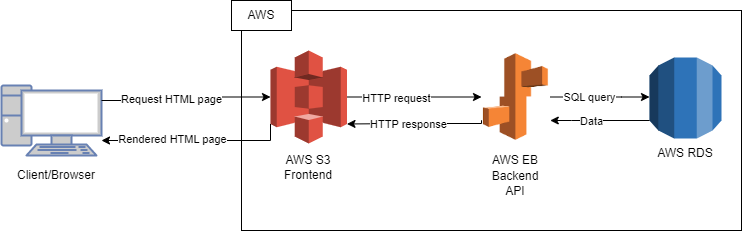

# Udagram 

A project that demonstrate how to deploy a fullstack app to AWS.
 
You can check the app from this [link](http://udgram-frontend.s3-website-us-east-1.amazonaws.com)

this project includes:

1. Creating an AWS RDS instance and connect a Nodejs App to it.  
2. Deploying a backend API to AWS using Elastic Beanstalk.
3. Deploying a frontend application to AWS using S3 Static website hosting.
4. Creating a CI/CD pipeline using CircleCi and Github.

## Application Architecture

### Description

* The user opens the browser and visits the web app
* The server aka (AWS S3 Static Web Hosting) receives the request and responds with the requested page
* The web app send a HTTP request to the backend server hosted on (AWS Elastic Beanstalk) to get the data.
* The backend server receives the request and fetches the data from the database (AWS RDS) and sends it back to the frontend.
* The data gets displayed.

## CI/CD Pipeline

### Description

* A developer commits his code changes to the Github Repo
* A CI/CD trigger gets triggered.
* The pipeline gets the new changes and pushes them to AWS

## Screenshots

You can find screenshots with the infrastructure and the CI/CD pipeline in the `screenshots` folder

## Getting started

1. [Backend Doc](./udagram-api/README.md)
2. [Frontend Doc](./udagram-frontend/README.md)

## Built With

  

    
    
    
    
    
    
    
    
    

